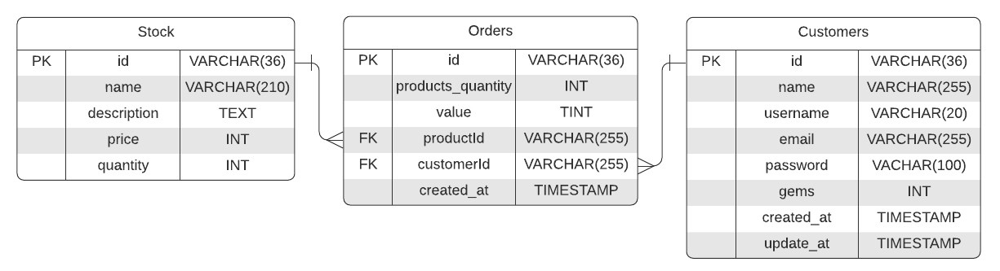

<h1 align = "center">  :shield: Secret Guns

<p align="center"> 
    
    
    
    
</p>

<p align="center"> 
    <a href="#rocket-tecnologias">Tecnologias</a>          |
    <a href="#computer-projeto">Projeto</a>          |
    <a href="#hammer-instalação">Instalação</a>
</p>

## :rocket: Tecnologias

- NodeJS

- Express

- Typescript

- MySQL

- ESLint

- TypeORM

- Bcrypt

## :computer: Projeto

Com a Torre dos Vingadores vazia após o BLIP, diversas armas secretas e únicas, como o escudo do Capitão América e o Cetro de Loki, foram encontradas e você pode adquirir uma aqui!

**GET**

stock/

order/customerByOrderID/{id}

order/productDetailsByOrderID/{id}

**POST**

costumer/

```
}
    "user": 
    "password": 
} 
```

stock/
```
}
    "name": 
    "quantity": 
} 
```

order/
```
}
    "productsQuantity": 
    "product": (id)
    "costumer": (id)
} 
```

**DELETE**

order/{id}

**PATCH**

/stock/{id}
```
{   
    "quantity": 
}
```

**PUT**

costumer/{id}
```
{
    "user": 
    "password": 
}

```


## DIAGRAMA
<p align="center" >

</p>


## :hammer: Instalação

Clone este repositório e utilize o seguinte comando no terminal:

```npm install```

Para rodar a aplicação:

 ```npm run dev```
